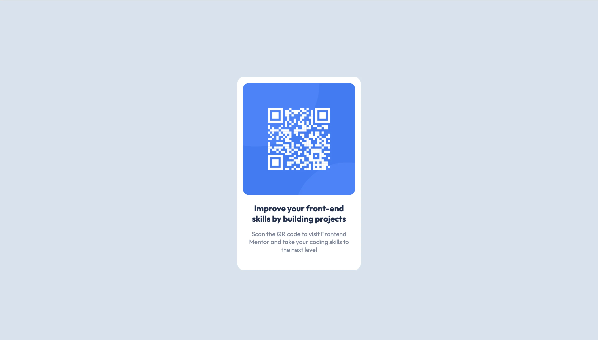
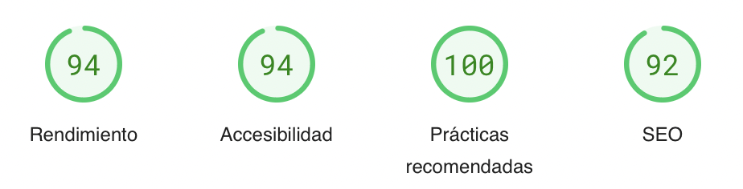
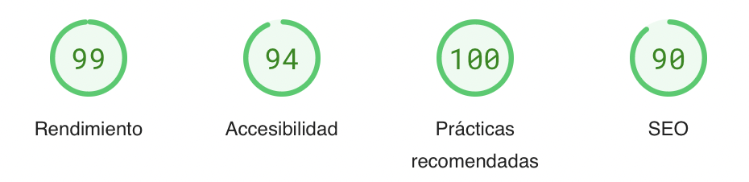

<!-- Proyect -->

  

  <h2 align="center">QR-code-component</h2>
  

    <a href="https://www.frontendmentor.io/challenges/qr-code-component-iux_sIO_H" target="_blank"><strong>Frontend Mentor Challenge</strong></a>
     
     
    <a href="https://incandescent-starship-157aae.netlify.app/" target="_blank">View Demo</a>
    &nbsp;·&nbsp;
    <a href="https://www.frontendmentor.io/solutions/qr-code-component-r7zlmeEa9u" target="_blank">Report Feedback</a>
  

  <!-- Profile -->
   &nbsp;&nbsp;&nbsp;

  <!-- Status -->
   &nbsp;&nbsp;&nbsp;

  <!-- Difficulty -->
  

 
 

<!-- preview -->

  <h2>Preview</h2>
  

# ------- Pagespeed Insights Score -------
  
- ||
  |  |
  | |
  |  |
  | |
  | Check out [**Pagespeed Insights**](https://pagespeed.web.dev/analysis/https-incandescent-starship-157aae-netlify-app/lxwerrjjc5?form_factor=mobile) to get live score |
  ||

 
